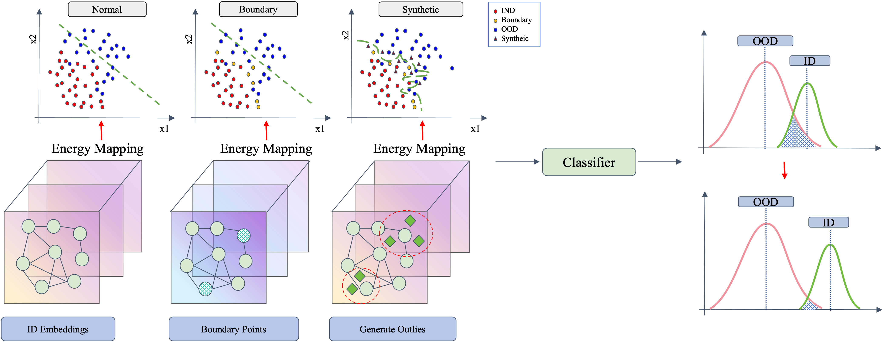
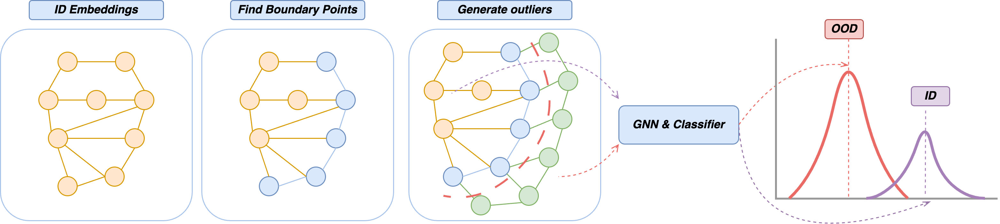

# Graph Outlier Synthesis

***Out-of-Distribution Detection for Graph Neural Networks***



## Methodology

**KNN is utilized to generate the OOD dataset, while GNN is used for embedding.
The embedding results are filtered using an 'Energy' function, and finally classified by a classifier.**

When the generated OOD data is sufficiently accurate, this data augmentation method can improve the accuracy of the original method.
At worst, it maintains the same level of accuracy.
However, if errors are present in the OOD data, it can lead to misclassification, thereby decreasing the accuracy of the original method.

To address this issue, a data quality assessment method can be introduced post-data generation.
The energy function can be employed to filter the synthetic data.
The filtering criterion is based on the transformed energy function's value being above or below a certain threshold.
Only data satisfying this condition are used for model training.



### Steps

- **Identify graph data samples near the boundary**
- **Synthesize outliers based on boundary samples**
- **Filter the outliers by energy function**
- **Training Graph neural network with Synthesize outliers**

## Experiment

***loss = supervised_learning_loss + energy_regularization_loss + classifier_loss***

1. Obtain the output of the GNN for the ID data to compute the `supervised learning loss`.
2. Calculate the `Energy ID` and `Energy OOD` using the ID outputs and OOD outputs.
3. If energy propagation is used, further process the `Energy ID` and `Energy OOD`.
4. Compute the `energy regularization loss`.
5. Train the classifier using both ID and OOD data, optionally filtering the synthesized data using energy, to obtain the
   `classifier loss`.

## Math Details

- Input Space

```math
\begin{equation}
X=\mathbb{R}^d
\end{equation}
```

- Label Space

```math
\begin{equation}
Y_{\text {in }}=\{1, \ldots, C\}
\end{equation}
```

- Decision boundary

```math
\begin{equation}
\beta \text { level set }\left\{\mathbf{x}: \hat{\mathbb{P}}_{\mathrm{in}}(\mathbf{x})=\beta\right\}
\end{equation}
```

- Model training with ID

```math
\begin{equation}
\mathcal{D}_{\text {in }}=\left\{\left(\mathbf{x}_i, y_i\right)\right\}_{i=1}^n
\end{equation}
```

- Joint data distribution

```math
\begin{equation}
\mathbb{P}_{X Y_{\text {in }}}
\end{equation}
```

- OOD conditional distribution

```math
\begin{equation}
Q(\mathbf{x} \mid \text { OOD })=\frac{1\left[\hat{\mathbb{P}}_{\text {in }}(\mathbf{x}) \leq \beta\right] \hat{\mathbb{P}}_{\text {in }}(\mathbf{x})}{\mathcal{Z}_{\text {out }}}
\end{equation}
```

- OOD Marginal Probability

```math
\begin{equation}
\mathcal{Z}_{\text {out }}=\int 1\left[\hat{\mathbb{P}}_{\text {in }}(\mathbf{x}) \leq \beta\right] \hat{\mathbb{P}}_{\text {in }}(\mathbf{x}) d \mathbf{x}
\end{equation}
```

- ID conditional Probability

```math
\begin{equation}
Q(\mathbf{x} \mid \text { ID })=\frac{1\left[\hat{\mathbb{P}}_{\text {in }}(\mathbf{x})>\beta\right] \hat{\mathbb{P}}_{\text {in }}(\mathbf{x})}{1-\mathcal{Z}_{\text {out }}}
\end{equation}
```

- ID Marginal Probability

```math
\begin{equation}
1-\mathcal{Z}_{\text {out }}=1 - \int 1\left[\hat{\mathbb{P}}_{\text {in }}(\mathbf{x}) \leq \beta\right] \hat{\mathbb{P}}_{\text {in }}(\mathbf{x}) d \mathbf{x}
\end{equation}
```

## Dataset

| name         | num_nodes | num_features | num_classes | num_edges |
|--------------|-----------|--------------|-------------|-----------|
| Cora         | 1433      | 2708         | 7           | 10556     |
| Coauthor-CS  | 18333     | 6805         | 15          | 163788    |
| Amazon-Photo | 7650      | 745          | 8           | 238162    |
| Arxiv        | 169343    | 128          | 40          | 1166243   |
| Twitch       | 9498      | 128          | 2           | 315774    |      

## Environment

- CentOS Linux 7
- NVIDIA A100-PCIE-40GB
- CUDA Version: 11.8
- Python 3.12

### Dependency

- torch==2.3.0
- torch_geometric==2.5.0
- torch_sparse==0.6.18+pt23cu118
- torch_scatter==2.1.2+pt23cu118

> https://data.pyg.org/whl/

### Install

We recommend using `conda` to manage project dependencies.
You can choose to install step by step or copy our environment directly.

```shell
# Install step by step
conda create -n GraphOutlierSynthesis python==3.12
conda activate GraphOutlierSynthesis
pip install -r requirements.txt

# If use GPU
conda install pytorch==2.3.0 pytorch-cuda=11.8 -c pytorch -c nvidia
conda install faiss-gpu==1.8.0 -c pytorch
pip install torch_geometric==2.5.0
pip install torch-scatter==2.1.2 -f https://data.pyg.org/whl/torch-2.3.0+cu118.html
pip install torch_sparse==0.6.18 -f https://data.pyg.org/whl/torch-2.3.0+cu118.html

# If use CPU (optional)
pip install torch==2.3.0
pip install faiss-cpu==1.9.0
pip install torch_geometric==2.5.0
pip install torch-scatter==2.1.2 -f https://data.pyg.org/whl/torch-2.3.0+cpu.html
pip install torch-sparse==0.6.18 -f https://data.pyg.org/whl/torch-2.3.0+cpu.html

# If need additional dataset (optional)
pip install ogb==1.3.6
```

> When installing 'torch_sparse' and 'torch_scatter', we recommend downloading wheel from https://data.pyg.org/whl/

## Usage

```shell
conda activate GraphOutlierSynthesis

# run the baseline
python src/main.py --method "gnnsafe" --backbone "gcn" --dataset "cora" --ood_type "structure" --device 0 --epochs 100

# run our method
python src/main.py --method "gnnsafe" --backbone "gcn" --dataset "cora" --ood_type "structure" --device 0 --epochs 100 --synthesis_ood --use_energy --use_energy_propagation --use_classifier

# visualize the generated outliers
python src/visualization.py
```